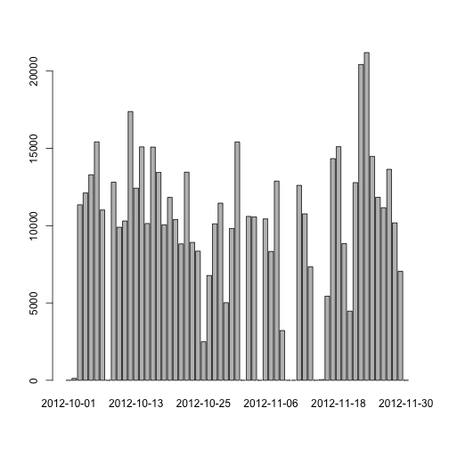
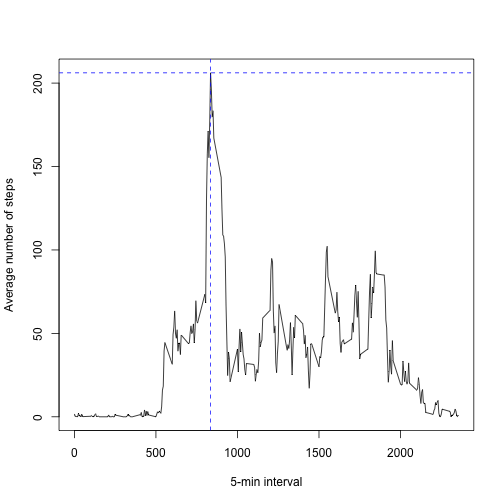
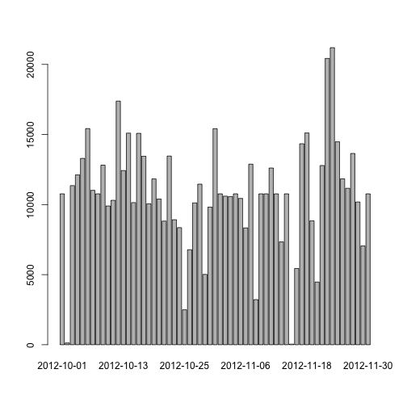

# Reproducible Research: Peer Assessment 1


## Loading and preprocessing the data


```r
activityData <- read.csv("activity.csv") # loading data
activityData[, 2] = as.Date(activityData[, 2]) # date data to date format
```

## What is mean total number of steps taken per day?


```r
## calculating total number of steps taken each day
stepsPerDay <- tapply(activityData$steps, activityData$date, function(x) {sum(x, na.rm=TRUE)})

## plotting histogram
barplot(stepsPerDay)
```

 

```r
## calculating mean and median total number of steps taken per day
mean <- mean(stepsPerDay)
median <- median(stepsPerDay)
```

The **mean** and **median** total number of steps taken per day are 9354.2295 and 10395 respectively.

## What is the average daily activity pattern?


```r
## calculating the average number of steps taken, averaged across all days
stepsPerInt <- tapply(activityData$steps, activityData$interval, function(x) {mean(x, na.rm=TRUE)})

## vector with intervals
intervals <- unlist(dimnames(stepsPerInt), recursive = TRUE, use.names = TRUE)

## calculating the maximum number of steps on average across all the days in the dataset
maxSteps <- max(stepsPerInt)

## which 5-minute interval has maximum number of steps on average
maxInterval <- names(which.max(stepsPerInt))

## making a plot
plot(intervals, stepsPerInt, type = "l", xlab = "5-min interval", ylab="Average number of steps")
abline(h=maxSteps,col="blue",lty=2)
abline(v=maxInterval,col="blue",lty=2)
```

 

As you can see from the plot above the 835-th 5-minute interval, on average across all the days in the dataset, contains the maximum number of steps of 206.1698.

## Imputing missing values


```r
naValues <- sum(is.na(activityData$steps)) # calculating total number of missing values in the dataset
```

The total number of missing values in the dataset (i.e. the total number of rows with NAs) is equal to 2304.


```r
newActivityData = activityData # copying dataset
meanStepsPerDay <- tapply(activityData$steps, activityData$date, function(x) {mean(x, na.rm=TRUE)}) # calculating mean steps per day
numRows <- length(activityData$steps)

## devising a strategy for filling in all of the missing values in the dataset
## in case of missing value we replace it with mean value for observations of the corresponding day
## in case there were no observations during that day we replace NA value with mean value throughout all intervals in the dataset
for (i in 1:numRows) {
        if(is.na(activityData[i,1])) {
                if(is.na(meanStepsPerDay[activityData[i, 2]])) {
                        newActivityData[i,1] <- mean(activityData$steps, na.rm=TRUE)
        }
                else newActivityData[i,1] <- meanStepsPerDay[activityData[i, 2]]
        }
}

## calculating total number of steps taken each day in the new dataset
newStepsPerDay <- tapply(newActivityData$steps, newActivityData$date, function(x) {sum(x, na.rm=TRUE)})

## plotting histogram
barplot(newStepsPerDay)
```

 

```r
## calculating new mean and median
newMean <- mean(newStepsPerDay)
newMedian <- median(newStepsPerDay)

## calculating difference in percents: ( |a - b| * 2 / (a + b) ) * 100%
meanDif <- abs(newMean - mean) * 200/(mean + newMean)
medianDif <- abs(newMedian - median) * 200/(median + newMedian)
```

We have replaced all the missing values in **steps** variable in the dataset with the mean value for that day. If there were no steps data available throughout that day we replaced used overall interval mean throughout whole dataset.

We have recalculated **mean** and **median** of total number of steps taken per day for the new dataset. Here are corresponding values: 1.0766 &times; 10<sup>4</sup>, 1.0766 &times; 10<sup>4</sup>.

These values differ from the estimates from the first part of the assignment (which were: 9354.2295 and 10395) by 14.0351% (mean difference) and 3.5082% (median difference). Imputing missing data have slightly increased the estimates of the total daily number of steps.

## Are there differences in activity patterns between weekdays and weekends?


```r
## function returning "weekday" for Mo-Fr and "weekend" for Sa-Su
weekDayIndicator <- function(x) {
        if(weekdays(x) == "суббота" || weekdays(x) == "воскресенье") return("weekend")
        else return("weekday")
} 

## creating a new factor variable in the new dataset with two levels – “weekday” and “weekend” indicating whether a given date is a weekday or weekend day.
newActivityData$weekday <- unlist(lapply(newActivityData[,2], weekDayIndicator))
newActivityData$weekday <- as.factor(newActivityData$weekday)

## calculating the average number of steps taken, averaged across all weekday days and plotting corresponding histogram
newStepsPerIntWeekday <- tapply(newActivityData[newActivityData$weekday == "weekday", 1], newActivityData[newActivityData$weekday == "weekday", 3], function(x) {mean(x, na.rm=TRUE)})
plot(intervals, newStepsPerIntWeekday, type = "l", xlab = "Interval", ylab="Number of steps on weekdays",)
```

 

```r
## calculating the average number of steps taken, averaged across all weekend days and plotting corresponding histogram
newStepsPerIntWeekend <- tapply(newActivityData[newActivityData$weekday == "weekend", 1], newActivityData[newActivityData$weekday == "weekend", 3], function(x) {mean(x, na.rm=TRUE)})
plot(intervals, newStepsPerIntWeekend, type = "l", xlab = "Interval", ylab="Number of steps on weekends",)
```

 
